# Ride (Android, Jetpack Compose)

A modern Android app showcasing authentication (Firebase), Google Maps with category exploration, a simple chat bot, a mock ML reviews module, and media capture (photo/video/audio) – all using Material 3 and Compose Navigation.


## 📸 Application Screenshots  

### 🏁 Core UI & App Launch Screens  
| Login | App Start Screen | Registration | Dashboard | UI Interface | Restaurant Maps | Cafes Maps |
|---|---|---|---|---|---|---|
| 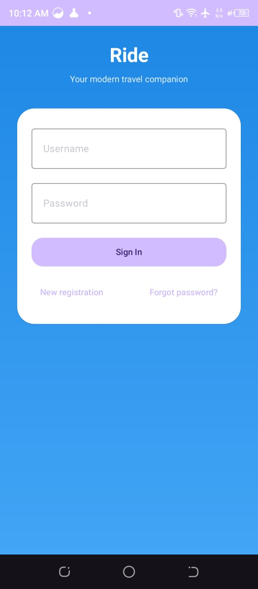 | 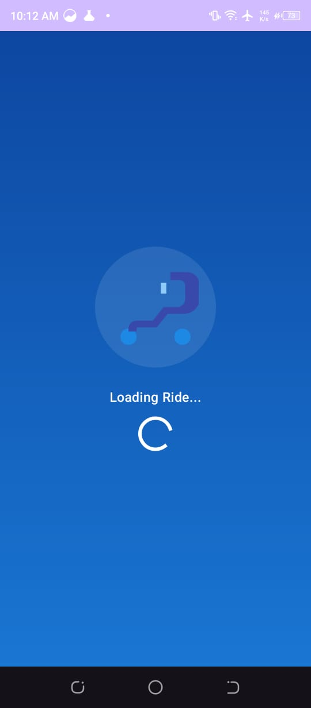 | 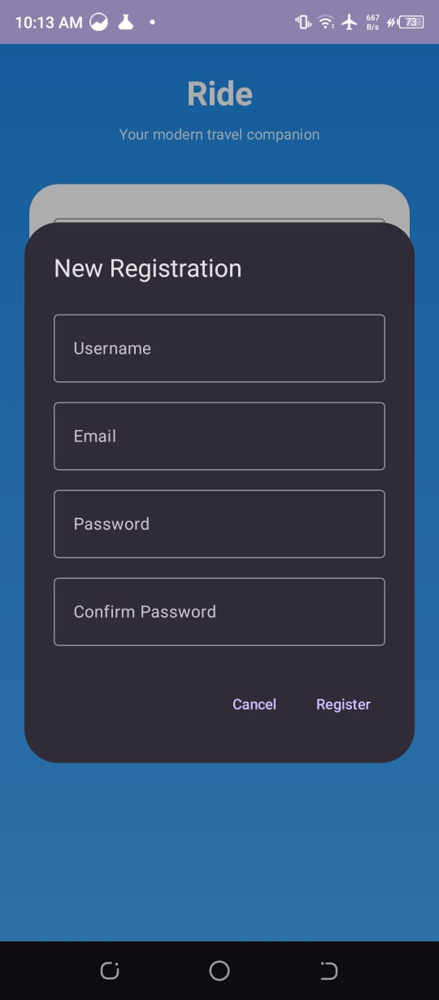 | 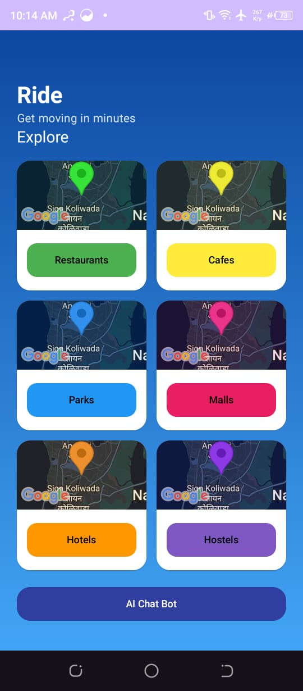 | 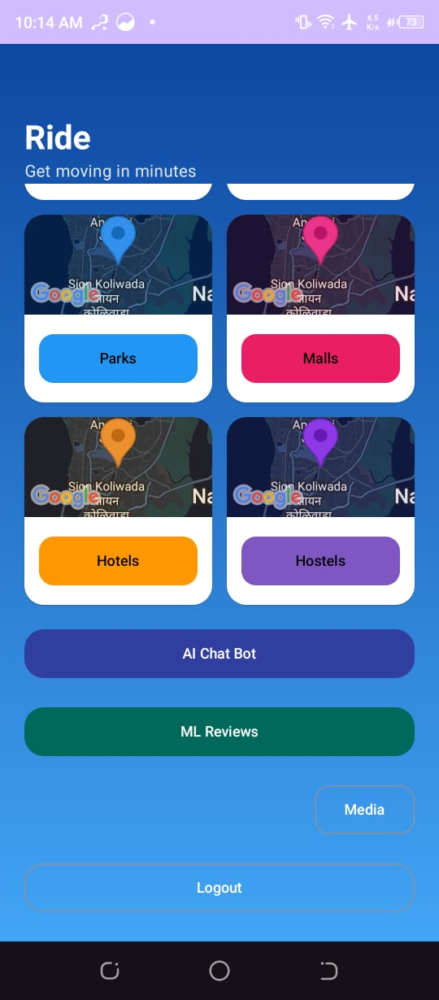 | 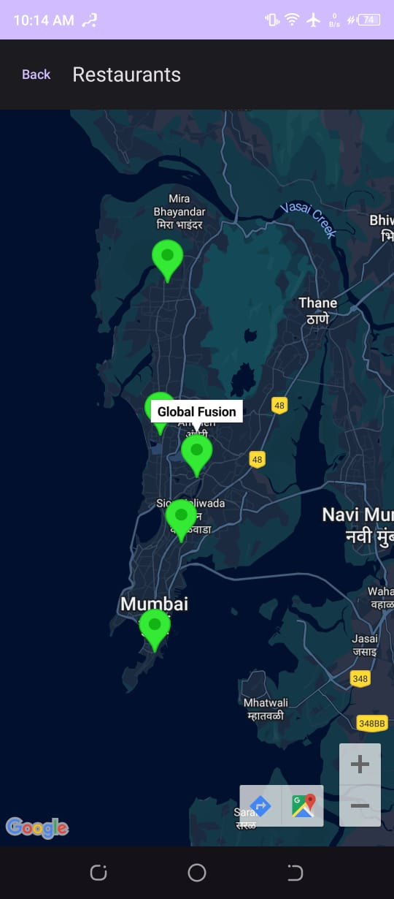 | 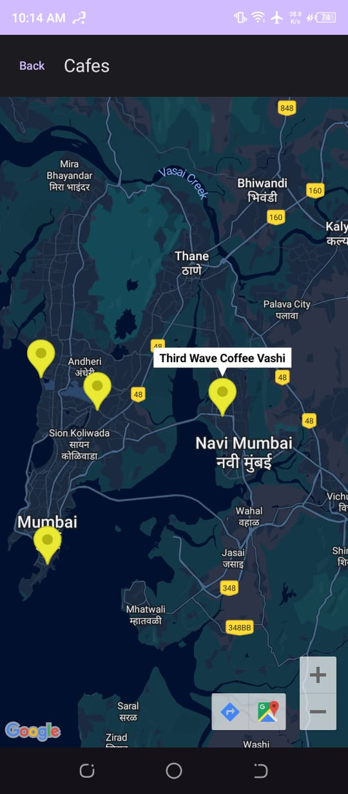 |

---

### 🌍 Location-Based Suggestions & AI Models  
| Parks Map | Malls Map | Hotels Map | Hostels Map | AI Chatbot | ML Hotels Model | ML Parks Model |
|---|---|---|---|---|---|---|
| 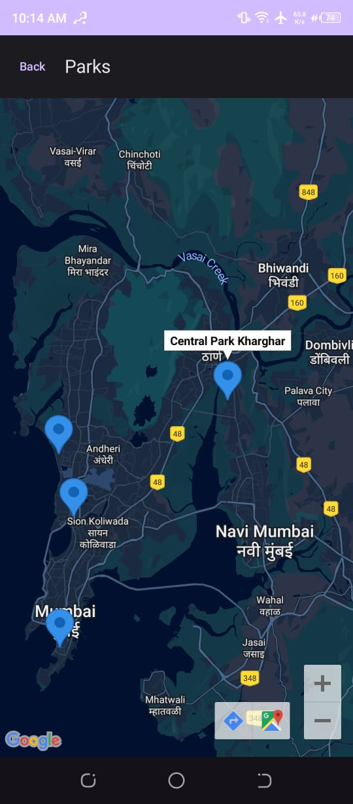 | 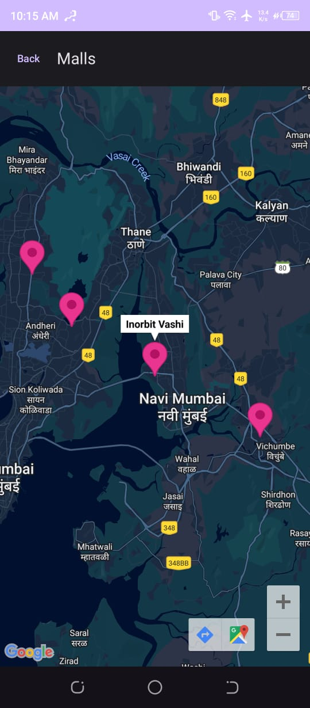 | 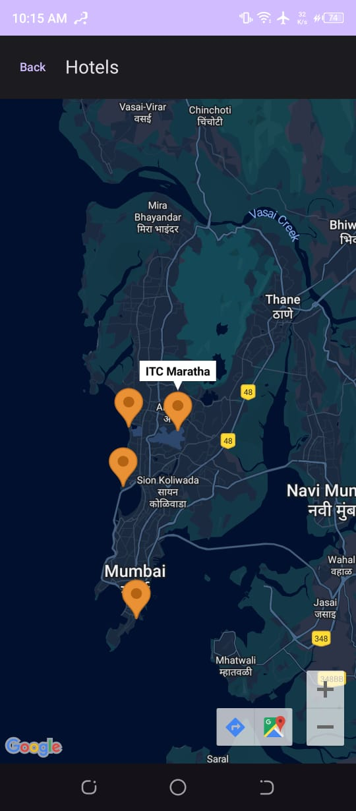 | 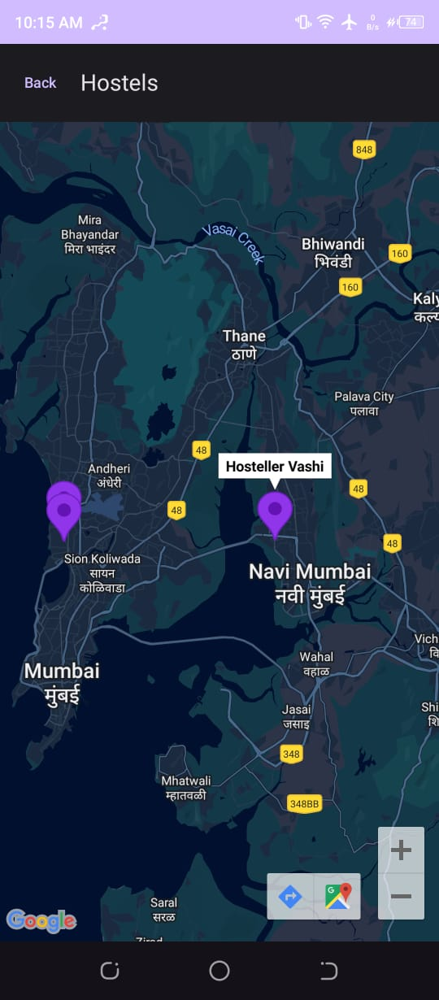 | 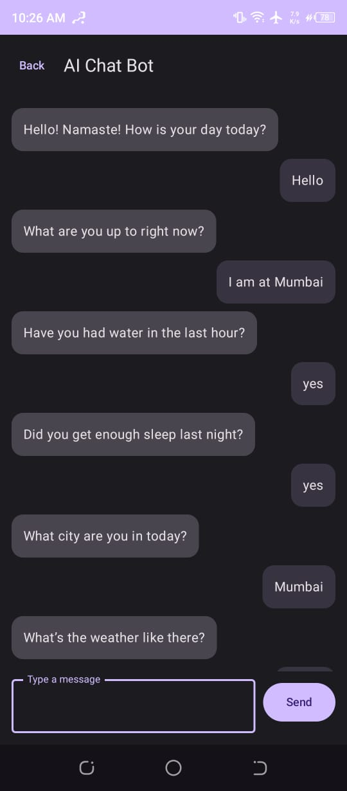 | 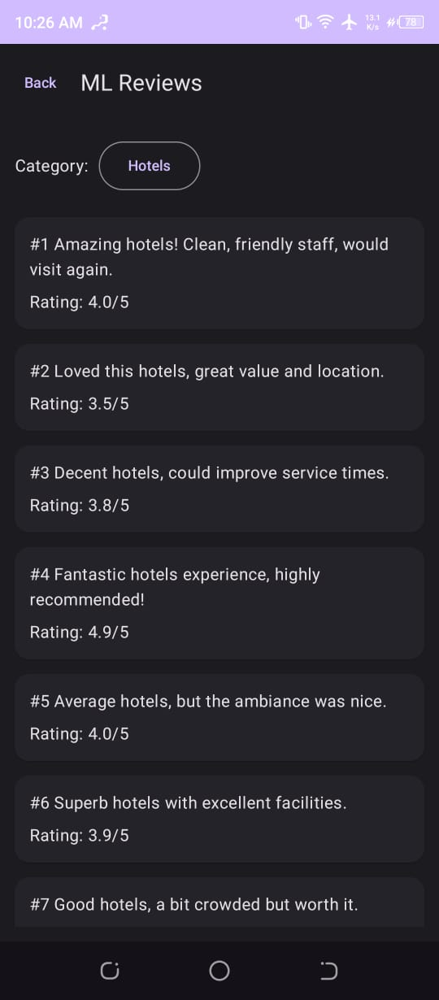 |  |

---

### 🔥 ML Filters + Firebase System Screens  
| ML Search Filters | Multimedia | AI Notifications | Firebase Auth | Firebase Users | Cloud Messaging | Firebase Project Details |
|---|---|---|---|---|---|---|
| 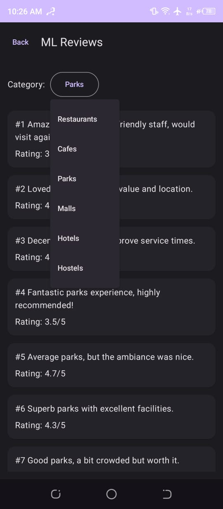 | 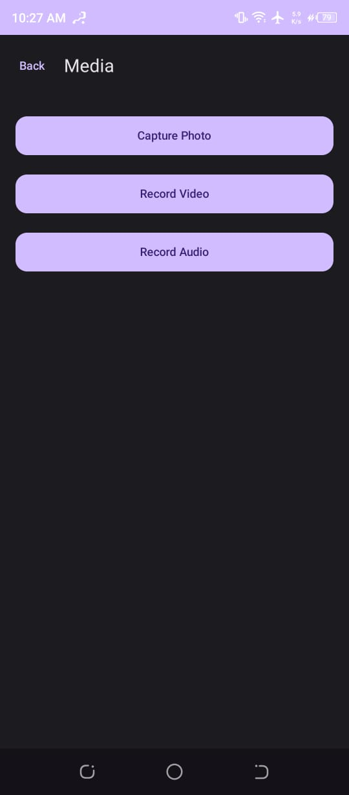 | 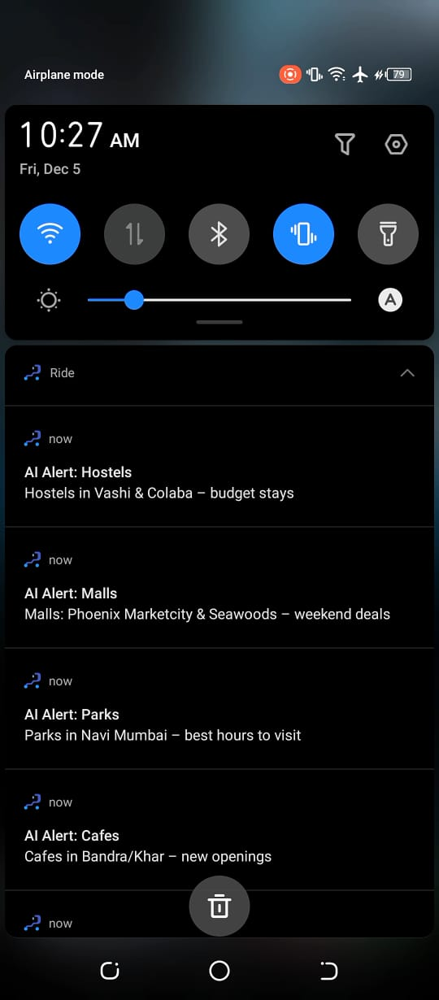 | 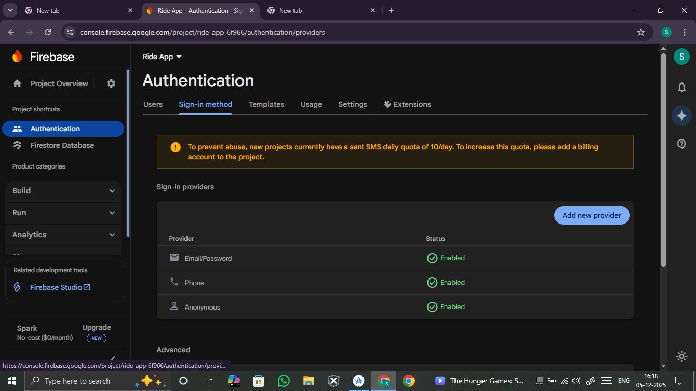 | 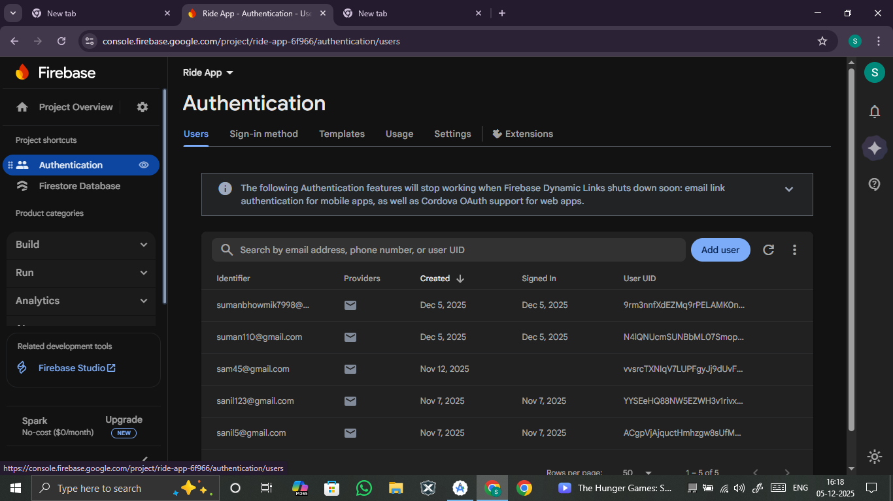 | 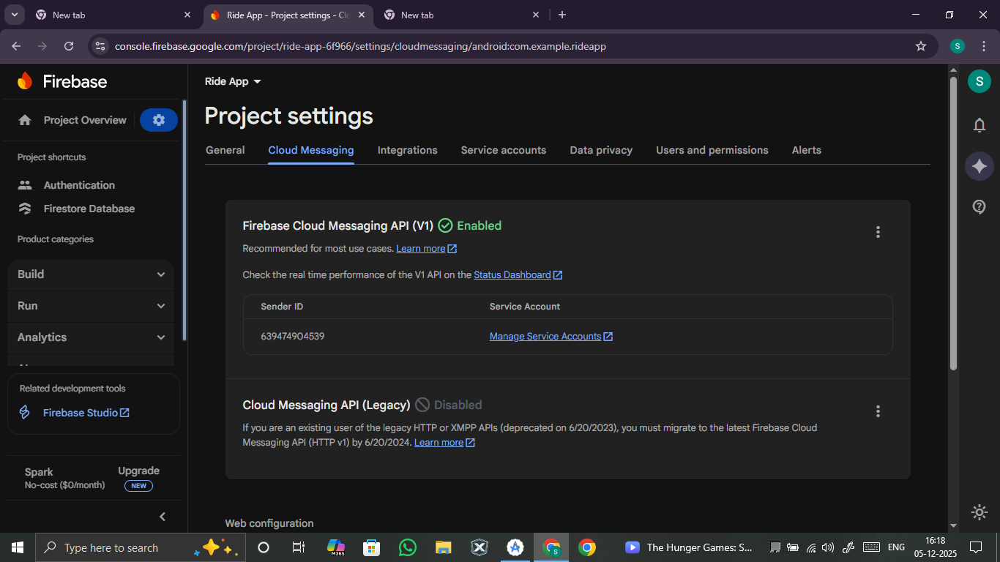 | 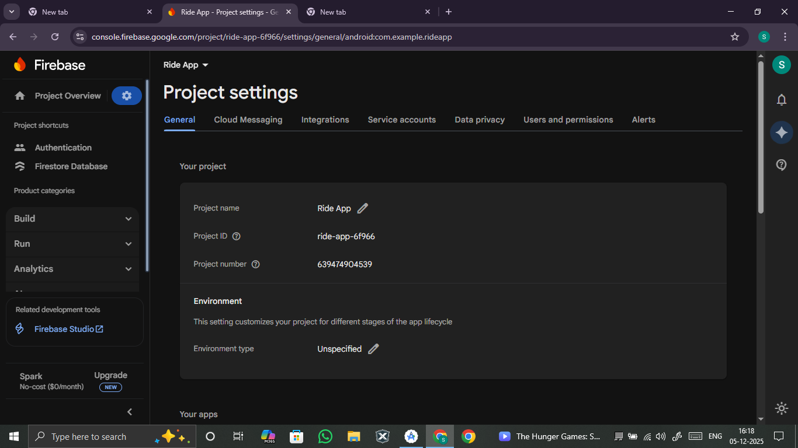 |


## App Summary
- Application ID: `com.example.rideapp` (note the mismatch with `namespace`; see Notes)
- Min SDK: 24
- Target/Compile SDK: 34
- Language: Kotlin (JDK 17)
- UI: Jetpack Compose + Material 3
- Navigation: `navigation-compose`
- Maps: Google Maps + Maps Compose
- Backend: Firebase Auth + Firestore (via BoM)
- Permissions: Internet, Network State, Notifications, Camera, Record Audio


## Features
- Authentication
  - Username-based login backed by Firebase Auth (resolves username → email in Firestore).
  - Registration with unique username claim stored in Firestore collection `usernames` and user profile in `users`.
  - Basic “Forgot password” dialog (demo/placeholder behavior).

- Explore by Map Categories
  - Browse categories: Restaurants, Cafes, Parks, Malls, Hotels, Hostels.
  - Category cards show mini static maps (disabled gestures) with tinted overlays.
  - Full-screen category map with markers around Mumbai / Navi Mumbai for sample POIs.

- AI Chat Bot (Demo)
  - Pre-seeded list of conversational prompts; alternates bot/user messages.
  - Simple message list using `LazyColumn`.

- ML Reviews (Mock)
  - Generates deterministic mock reviews and ratings for the selected category.
  - Dropdown to switch category; 100 reviews rendered in a list.

- Media Capture
  - Capture Photo to MediaStore (DCIM/Ride on API 29+).
  - Record Video to MediaStore (Movies/Ride on API 29+).
  - Record Audio using `MediaStore.Audio.Media.RECORD_SOUND_ACTION` intent.
  - Requests runtime permissions for Camera and Record Audio.

- Notifications
  - Creates Notification Channel `ride_ai_alerts` on first launch.
  - On successful login/registration, sends a batch of sample category recommendations.


## Screens and Navigation
- Routes defined in `MainActivity.kt`:
  - `splash` → `login` → `home`
  - `home` → `map/{category}` | `chatbot` | `ml` | `media`
- Composables:
  - `SplashScreen`
  - `LoginScreen` (+ `RegisterDialog`, `ForgotPasswordDialog`)
  - `MainHomeScreen` (+ `CategoryGrid`, `CategoryMapButton`)
  - `CategoryMapScreen`
  - `ChatBotScreen`
  - `MLScreen`
  - `MediaScreen`
- Enum: `PlaceCategory` (with label, route, color, markerHue)


## Dependencies (key)
- Android Gradle Plugin 8.5.2, Kotlin 1.9.24
- Compose BOM 2024.06.00
- `androidx.activity:activity-compose:1.9.0`
- `androidx.compose.material3:material3`
- `androidx.navigation:navigation-compose:2.7.7`
- Google Maps: `play-services-maps:18.2.0`, `maps-compose:4.4.1`
- Coroutines: `kotlinx-coroutines-android:1.8.1`
- Firebase BoM `33.4.0` (+ Auth, Firestore)

See `app/build.gradle.kts` for full list and versions.


## Build & Run
1. Open the project in Android Studio (Giraffe or newer recommended).
2. Use JDK 17 (configured by Gradle toolchain).
3. Ensure Android SDK Platform 34 is installed.
4. Configure Google Maps and Firebase (below), then Sync Gradle.
5. Run on device/emulator (Android 7.0+, API 24+).

Gradle tasks:
- Assemble: `./gradlew assembleDebug`
- Install: `./gradlew installDebug`


## Configuration

### 1) Google Maps API Key
The project currently declares a meta-data entry in `AndroidManifest.xml`:
```xml
<meta-data
    android:name="com.google.android.geo.API_KEY"
    android:value="YOUR_API_KEY_HERE"/>
```
In the current codebase, a direct key is present. Replace it with your own API key. Recommended: move to a manifest placeholder to avoid committing secrets.

Option A – Direct (quick, not recommended for production):
- Edit `app/src/main/AndroidManifest.xml` and set your key.

Option B – Manifest placeholder (recommended):
- In `app/build.gradle.kts` defaultConfig, add:
```kotlin
manifestPlaceholders["MAPS_API_KEY"] = providers.gradleProperty("MAPS_API_KEY").getOrElse("")
```
- In `AndroidManifest.xml` use:
```xml
<meta-data android:name="com.google.android.geo.API_KEY" android:value="${MAPS_API_KEY}"/>
```
- In `local.properties` (not committed):
```
MAPS_API_KEY=your_real_key
```
Enable Maps SDK for Android in Google Cloud Console for the project owning your key.


### 2) Firebase
- Create a Firebase project.
- Enable Authentication (Email/Password).
- Create Firestore in native mode.
- Download `google-services.json` for Android app with package name `com.example.rideapp` (or your chosen applicationId) and place it under `app/`.
- Ensure `com.google.gms.google-services` plugin is applied (already present) and the Firebase BoM dependencies remain.

Firestore data used:
- `usernames/{usernameLower}` → `{ uid, email, createdAt }`
- `users/{uid}` → `{ username, usernameLower, email, createdAt, lastLogin? }`
- `loginEvents/{autoId}` → `{ uid, at }`

Security Rules (example starting point – adjust for your needs):
```javascript
rules_version = '2';
service cloud.firestore {
  match /databases/{database}/documents {
    match /usernames/{usernameLower} {
      allow create: if request.auth != null &&
        !exists(/databases/$(database)/documents/usernames/$(usernameLower));
      allow read: if true;
      allow update, delete: if false;
    }
    match /users/{uid} {
      allow read, write: if request.auth != null && request.auth.uid == uid;
    }
    match /loginEvents/{id} {
      allow create: if request.auth != null;
      allow read: if request.auth != null && request.resource.data.uid == request.auth.uid;
    }
  }
}
```


## Permissions
Declared in `AndroidManifest.xml`:
- `INTERNET`
- `ACCESS_NETWORK_STATE`
- `POST_NOTIFICATIONS`
- `CAMERA`
- `RECORD_AUDIO`

At runtime, the app requests `POST_NOTIFICATIONS` on Android 13+ and Camera/Record Audio before media capture.


## Theming
- Theme: `Theme.Ride` extends `Theme.Material3.DayNight.NoActionBar`.
- Dynamic dark/light via `isSystemInDarkTheme()`.
- Custom vector icon at `res/drawable/ic_scooter.xml`.


## Auth Flow Details
- `AuthRepository` wraps FirebaseAuth/Firestore.
- Registration sequence:
  1. `createUserWithEmailAndPassword(email, password)`.
  2. Transaction: create `usernames/{usernameLower}` if not exists.
  3. Create profile `users/{uid}`.
  4. On error: roll back auth user or surface error (e.g., USERNAME_TAKEN).
- Sign-in sequence:
  1. Lookup `usernames/{usernameLower}` to resolve email.
  2. `signInWithEmailAndPassword(email, password)`.
  3. Update `users/{uid}.lastLogin` and add `loginEvents` entry.


## Notifications
- `NotificationHelper.ensureChannel(context)` on startup.
- `sendCategoryNotifications(context)` builds and posts sample notifications after login/registration. Requires notification permission on Android 13+.


## Media Module Details
- Creates `MediaStore` entries before invoking camera/video intents to preserve output URIs.
- Uses `ActivityResultContracts` for TakePicture, CaptureVideo, and StartActivityForResult (audio record).
- On API 29+, sets `RELATIVE_PATH` for gallery placement.


## Known Notes and Caveats
- Application ID vs Namespace:
  - `namespace` is `com.sanil.ride`.
  - `defaultConfig.applicationId` is `com.example.rideapp`.
  - This is valid but can be confusing; if you plan to publish, align both to a real, owned package (e.g., `com.sanil.ride`). If you change `applicationId`, re-download `google-services.json` for the new ID.
- Maps API key is currently in manifest with a literal value; move to placeholders/environment for safety.
- `ForgotPasswordDialog` is a demo; it does not integrate with Firebase password reset.
- No DI framework; repository is created directly in composables.
- Demo POIs are static and limited to Mumbai/Navi Mumbai.


## How to Customize
- Categories/POIs: edit `PlaceCategory` and `categoryLocations()` in `MainActivity.kt`.
- Colors/Branding: update `themes.xml` and composable colors.
- App name/icon: `res/values/strings.xml` and `res/drawable/ic_scooter.xml`.
- Authentication: replace `AuthRepository` with your own data layer or add DI.


## Testing and QA (manual)
- Launch → Splash → Login screen after ~3s.
- Registration with a new username/email → navigates to Home and triggers notifications.
- Login with created username/password.
- Explore grid → open any category → verify markers render.
- Chatbot → send messages → verify bot replies cycle.
- ML Reviews → switch categories → list updates; ratings between 3.0–5.0.
- Media → capture photo/video/audio → snackbar confirms; check gallery folders.
- Notifications on Android 13+ → ensure permission is requested and notifications appear.


## Building for Release (outline)
1. Create a signing keystore and configure `signingConfigs` and `buildTypes.release`.
2. Enable minification and add keep rules for Compose/Maps/Firebase if needed.
3. Align `applicationId`, versioning, and app icon/name.
4. Generate release bundle: `./gradlew bundleRelease`.


## Troubleshooting
- Maps not showing / blank screen
  - Verify a valid Maps API key and that Maps SDK for Android is enabled.
  - Check logcat for `API key not authorized` messages.
- Firebase auth fails
  - Ensure `google-services.json` matches your `applicationId`.
  - Enable Email/Password sign-in in Firebase console.
- Notifications not appearing on Android 13+
  - Confirm POST_NOTIFICATIONS permission granted.
- Media capture fails on Android 10-
  - Verify storage permissions if you extend functionality. Current flows rely on MediaStore and should work without legacy storage permissions.


## License
This project is provided as-is for learning/demonstration purposes.

